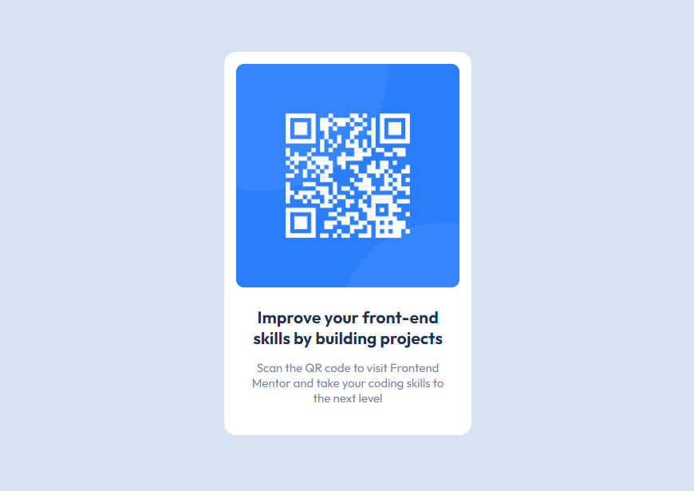

# Frontend Mentor - QR code component solution

This is a solution to the [QR code component challenge on Frontend Mentor](https://www.frontendmentor.io/challenges/qr-code-component-iux_sIO_H). Frontend Mentor challenges help you improve your coding skills by building realistic projects. 

## Table of contents

- [Overview](#overview)
  - [Screenshot](#screenshot)
  - [Links](#links)
- [My process](#my-process)
  - [Built with](#built-with)
  - [What I learned](#what-i-learned)
  - [Continued development](#continued-development)
- [Author](#author)

## Overview

### Screenshot

### Links

- Solution URL: [Click](https://www.frontendmentor.io/solutions/solution-using-flexbox-LV0X6XZ3c1)
- Live Site URL: [Click](https://rock-n-roll-crc.github.io/QR-code-component/)

## My process

### Built with

- Flexbox

### What I learned

While working on this project I consolidated my knowledge of basic HTML and CSS.

### Continued development

In future projects I want to focus on Responsive Design, using relative units.

## Author

- Frontend Mentor - [Rock_n_Roll_CRC](https://www.frontendmentor.io/profile/Rock-n-Roll-CRC)
- Twitter - [@Rock_n_Roll_CRC](https://twitter.com/Rock_n_Roll_CRC)