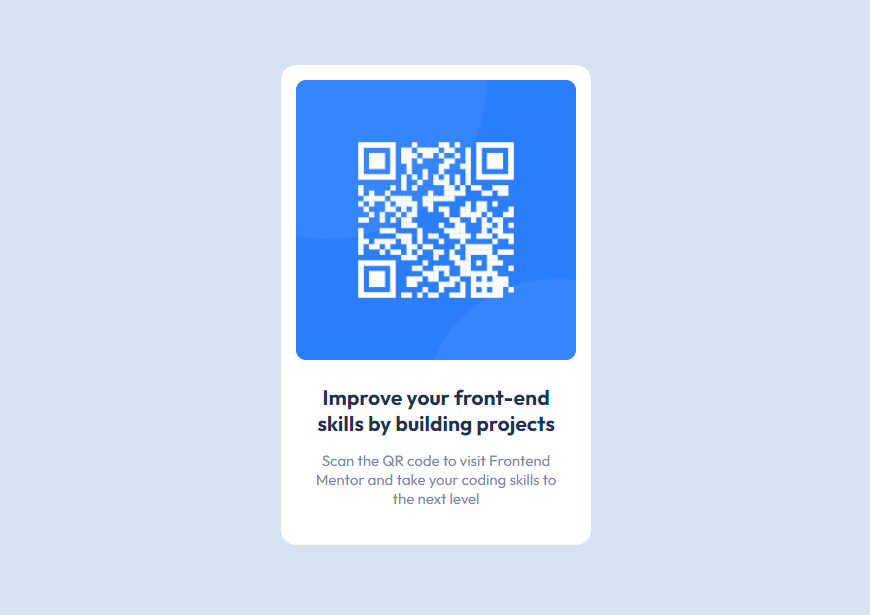

# Frontend Mentor - QR code component solution

This is a solution to the [QR code component challenge on Frontend Mentor](https://www.frontendmentor.io/challenges/qr-code-component-iux_sIO_H). Frontend Mentor challenges help you improve your coding skills by building realistic projects.

## Table of contents

- [Overview](#overview)
  - [Screenshot](#screenshot)
  - [Links](#links)
- [My process](#my-process)
  - [Built with](#built-with)
- [Author](#author)

## Overview

### Screenshot

### Links

- Solution URL: [https://www.frontendmentor.io/solutions/solution-using-flexbox-LV0X6XZ3c1](https://www.frontendmentor.io/solutions/solution-using-flexbox-LV0X6XZ3c1)
- Live Site URL: [https://rock-n-roll-crc.github.io/QR-code-component/](https://rock-n-roll-crc.github.io/QR-code-component/)

## My process

### Built with

- Semantic HTML5 markup
- Flexbox

## Author

- Frontend Mentor - [Rock_n_Roll_CRC](https://www.frontendmentor.io/profile/Rock-n-Roll-CRC)
- Twitter - [@Rock_n_Roll_CRC](https://twitter.com/Rock_n_Roll_CRC)
- Discord - Rock_n_Roll_CRC#2944